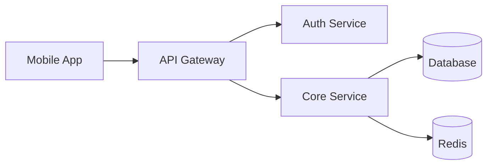
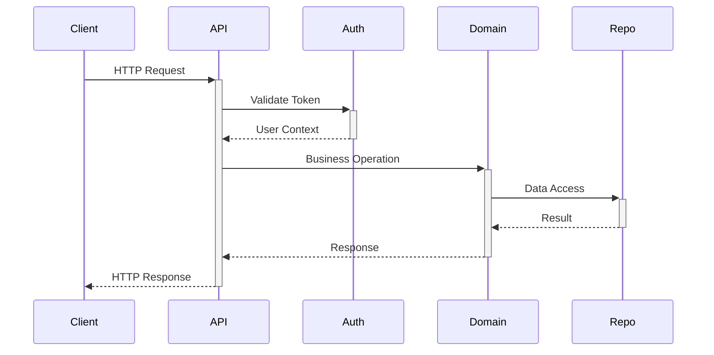
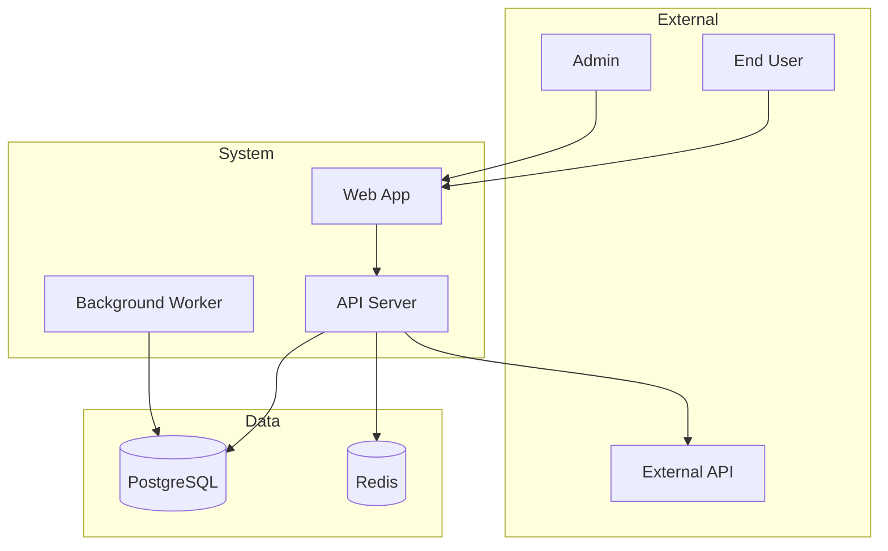
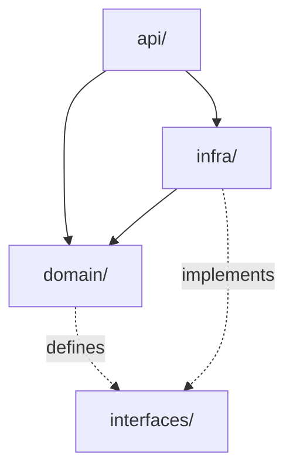
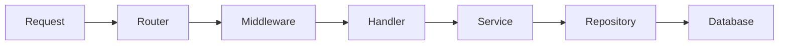

# Architecture Documentation for AI Agents

Best practices for writing `ARCHITECTURE.md` files and system documentation that AI agents can use to understand codebases without hallucinating.

> **Scope**: These guidelines apply to any architectural documentation intended for AI consumption—ARCHITECTURE.md files, system overviews, or design documents. The goal is documentation that prevents wrong-module changes and enables correct first attempts.

## Contents

| Section |
| --- |
| [Quick Reference](#quick-reference) |
| [Core Principles](#core-principles) |
| [Document Structure](#document-structure) |
| [Mermaid Diagram Patterns](#mermaid-diagram-patterns) |
| [Writing Effective Boundaries](#writing-effective-boundaries) |
| [Writing Invariants](#writing-invariants) |
| [Anti-Patterns](#anti-patterns) |
| [Maintenance](#maintenance) |

---

## Quick Reference

### What to Include

| Element | Purpose | Example |
| --- | --- | --- |
| **System context** | What the system does, who uses it | "API gateway for mobile clients" |
| **Module boundaries** | What each major component owns | "auth/ handles all authentication" |
| **Data flow** | How information moves through the system | "Request → Router → Handler → DB" |
| **Invariants** | Rules that must never be violated | "No direct DB access from handlers" |
| **Key patterns** | Architectural decisions in use | "Repository pattern for data access" |

### What to Omit

| Element | Problem | Alternative |
| --- | --- | --- |
| **File listings** | Stale immediately, wastes tokens | Let agent discover via tools |
| **Every function** | Too granular, maintenance burden | Document patterns, not instances |
| **Historical context** | Distracts from current state | Move to ADRs if important |
| **Implementation details** | Changes frequently | Focus on stable abstractions |
| **Auto-generated content** | Low signal, high noise | Curate manually |

---

## Core Principles

| Principle | Guideline | Rationale |
| --- | --- | --- |
| **Stable over volatile** | Document concepts that rarely change | Reduces maintenance burden |
| **Boundaries over internals** | Where modules meet, not how they work inside | Prevents wrong-module changes |
| **Visual over textual** | Mermaid diagrams for structure | Faster comprehension |
| **Constraints over descriptions** | What can't be done, not just what exists | Prevents architectural violations |
| **Capability over structure** | What modules do, not what files they have | Survives refactoring |

---

## Document Structure

### Minimal ARCHITECTURE.md

```markdown
# Architecture

## System Context
[One paragraph: what this system does and who uses it]

## Module Boundaries

| Module | Responsibility | Owned By |
| --- | --- | --- |
| `src/api/` | HTTP handlers and routing | API team |
| `src/domain/` | Business logic | Core team |
| `src/infra/` | Database and external services | Platform team |

## Key Invariants
- Domain layer never imports from API or Infra
- All external calls go through service interfaces
- [Other critical rules]

## Data Flow
[Mermaid diagram or simple description]
```

### Full Template

````markdown
# Architecture: [System Name]

## Overview
[2-3 sentences: what this system does, its primary users, and deployment context]

## System Context Diagram



## Module Boundaries

| Module | Responsibility | Dependencies | Notes |
| --- | --- | --- | --- |
| `api/` | HTTP layer | domain, infra | No business logic here |
| `domain/` | Business rules | (none) | Pure, no I/O |
| `infra/` | External services | domain | Implements interfaces |

## Key Invariants

| Invariant | Rationale | Violation Example |
| --- | --- | --- |
| Domain has no external dependencies | Testability, portability | Importing `fetch` in domain |
| Handlers don't access DB directly | Separation of concerns | SQL in controller |
| All errors use custom error types | Consistent handling | Throwing generic Error |

## Data Flow

### Request Lifecycle



## Key Patterns

| Pattern | Where Used | Why |
| --- | --- | --- |
| Repository | Data access | Abstracts storage details |
| Result type | Error handling | Explicit error paths |
| Dependency injection | Services | Testability |

## Technology Stack

| Layer | Technology | Version | Notes |
| --- | --- | --- | --- |
| Runtime | Node.js | 20+ | LTS only |
| Framework | Express | 4.x | |
| Database | PostgreSQL | 15+ | Primary store |
| Cache | Redis | 7+ | Sessions, rate limits |

## See Also

- [ADR-001: Why we chose PostgreSQL](docs/adr/001-database-choice.md)
- [API Documentation](docs/api/README.md)

````

---

## Mermaid Diagram Patterns

### System Context

Shows the system and its external actors/dependencies:



### Module Dependencies

Shows what depends on what:



### Data Flow

Shows how requests move through the system:



### Diagram Best Practices

| Practice | Rationale |
| --- | --- |
| One concept per diagram | Prevents overload |
| Meaningful node names | Self-documenting |
| Group related components | Visual hierarchy |
| Show direction of data/control | Clarifies flow |
| Keep under 15 nodes | Maintains readability |

---

## Writing Effective Boundaries

### Module Boundary Table

| Column | Purpose |
| --- | --- |
| **Module** | Path or logical name |
| **Responsibility** | What it owns (one sentence) |
| **Dependencies** | What it imports from |
| **Notes** | Critical constraints |

### Good vs Bad Boundaries

| Bad | Good | Why |
| --- | --- | --- |
| "src/utils/" | "src/utils/ - shared pure functions, no side effects" | States constraint |
| "Contains helper code" | "Date formatting, string manipulation, validation" | Specific capabilities |
| "Used by everything" | "Imported by: api/, domain/. Never imports from other modules" | Explicit direction |

---

## Writing Invariants

Invariants are rules that must never be violated. They prevent the most damaging mistakes.

### Invariant Format

| Good Invariant | Bad Invariant | Why |
| --- | --- | --- |
| "Domain layer never imports from infra" | "Keep code clean" | Testable, specific |
| "All public endpoints require authentication except /health" | "Secure endpoints properly" | Explicit exceptions |
| "Database migrations are append-only" | "Handle migrations carefully" | Clear rule |

### Categories of Invariants

| Category | Example |
| --- | --- |
| **Dependency direction** | "UI depends on Domain, never reverse" |
| **Data access** | "Only repositories touch the database" |
| **Security** | "Secrets only in environment, never in code" |
| **Consistency** | "All timestamps are UTC" |
| **Performance** | "No synchronous I/O in request handlers" |

---

## Anti-Patterns

| Anti-Pattern | Problem | Fix |
| --- | --- | --- |
| **File tree documentation** | Stale within days | Describe modules, let agent explore |
| **Implementation details** | Changes break docs | Focus on stable interfaces |
| **Missing invariants** | Agent violates architecture | Explicit rules that can't be broken |
| **Text-only structure** | Hard to parse | Mermaid diagrams for visual concepts |
| **Everything documented** | Token waste, noise | Only stable, important concepts |
| **Historical context inline** | Distracts from current state | Separate ADRs for decisions |
| **No module boundaries** | Agent doesn't know where code belongs | Explicit responsibility table |

---

## Maintenance

### When to Update

| Trigger | Action |
| --- | --- |
| New module added | Add to boundaries table |
| Architectural decision | Add invariant or pattern |
| Dependency change | Update tech stack table |
| Refactoring | Usually no change (capabilities stable) |

### Keeping Diagrams Current

| Practice | Rationale |
| --- | --- |
| Diagrams show concepts, not files | Survives refactoring |
| Update when topology changes | Only structural changes matter |
| Keep in version control with code | Changes reviewed together |
| Test diagram renders | Broken diagrams are invisible |

---

## See Also

- [Agentic Workflow](../agentic-workflow/agentic-workflow.md) – MAP phase uses this documentation
- [Documentation Guidelines](../documentation-guidelines/documentation-guidelines.md) – General documentation practices
- [AGENTS.md Guidelines](../agents-md/agents-md-guidelines.md) – Project-level agent configuration
