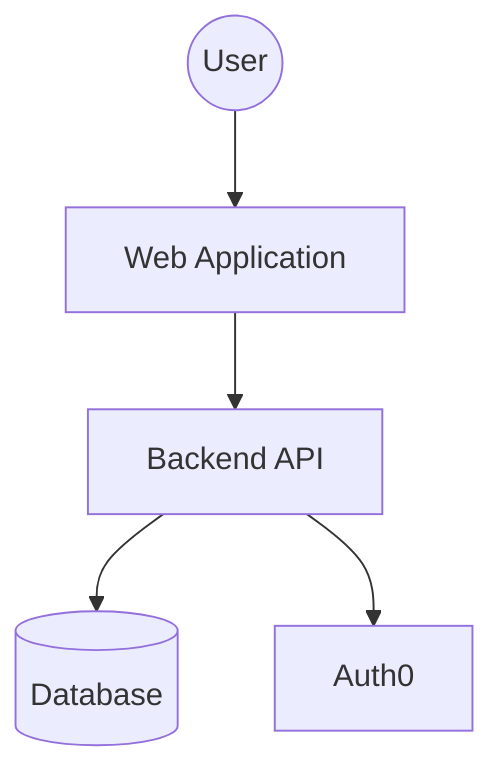
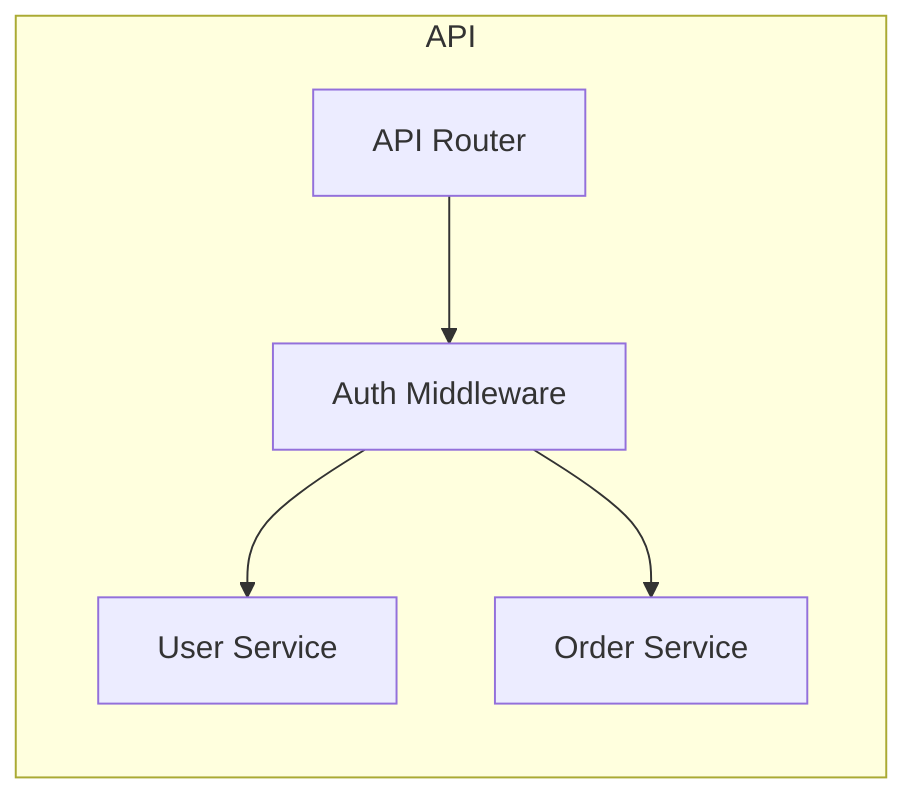

# Architecture for AI

Best practices for documenting system architecture in a way that AI coding agents can consume and reason about
effectively.

> **Scope**: These guidelines apply to architectural documentation—system diagrams, data flows, and design patterns.
> The goal is to provide high-level context that prevents architectural drift during agentic coding tasks.

## Contents

| Section |
| :--- |
| [Quick Reference](#quick-reference) |
| [Core Principles](#core-principles) |
| [System context](#system-context) |
| [Mermaid Diagram Patterns](#mermaid-diagram-patterns) |
| [Data Flow Documentation](#data-flow-documentation) |
| [Component Descriptions](#component-descriptions) |
| [Architecture Anti-Patterns](#architecture-anti-patterns) |
| [See Also](#see-also) |

---

## Quick Reference

| Feature | Guidance | Rationale |
| :--- | :--- | :--- |
| **Diagrams** | Use Mermaid.js text-based diagrams | Machine-parseable, version-controlled |
| **Level** | Focus on "Level 2" (Components) | Best balance of context and detail |
| **Flows** | Document request lifecycles | Explains how pieces interact |
| **Patterns** | Explicitly name design patterns | Evokes established mental models |
| **Files** | Link components to entry point files | Grounds abstract design in code |

---

## Core Principles

1. **Text over images** – If the AI can't read it, it doesn't exist.
2. **Context first** – Explain *why* a design exists before *how* it's built.
3. **Boundaries matter** – Clearly define what part of the system the agent is in.
4. **Link to source** – Direct paths from diagrams to files (`src/api/router.ts`).
5. **Keep it current** – Tell the agent to update diagrams when architecture changes.

---

## System Context

Provide a high-level overview of the system's surroundings.

| Element | Description | Rationale |
| :--- | :--- | :--- |
| **Users** | Who uses the system? | Defines persona and access patterns |
| **Integrations** | External APIs, databases | Defines boundaries and dependencies |
| **Infrastructure**| Cloud providers, edge, local | Defines environment constraints |

---

## Mermaid Diagram Patterns

Use Mermaid for all diagrams to ensure they are versioned and readable by AI.

### System Landscape (C4 Level 1)



### Component Diagram (C4 Level 2)



### Request Lifecycle

```mermaid
sequence_diagram
    participant U as User
    participant R as Router
    participant M as Middleware
    participant S as Service
    participant D as Database

    U ->> R: POST /orders
    R ->> M: Validate JWT
    M ->> S: createOrder(data)
    S ->> D: INSERT INTO orders
    D -->> S: order_id
    S -->> R: Order object
    R -->> U: 201 Created
```

---

## Data Flow Documentation

Document how data enters, flows through, and exits the system.

| Stage | Action | Component |
| :--- | :--- | :--- |
| **Ingress** | HTTP Request | `src/api/server.ts` |
| **Validation**| JSON Schema | `src/schemas/user.ts` |
| **Business** | Domain Logic | `src/domain/services/` |
| **Storage** | SQL Query | `src/infrastructure/db/` |
| **Egress** | JSON Response | `src/api/presenters/` |

---

## Component Descriptions

For each major component, provide a brief summary of its responsibility.

| Component | Responsibility | Constraints |
| :--- | :--- | :--- |
| **API Gateway** | Routing, Auth, Rate Limiting | No business logic allowed |
| **Core Engine** | Transaction processing | Must be pure functions |
| **Data Access** | SQL generation, Caching | No side effects other than DB |

---

### Good vs Bad Example

| Pattern | Example | Why |
| :--- | :--- | :--- |
| **Good** | Mermaid component diagram links directly to `src/api/router.ts` and `src/core/engine.ts` | Agent can connect architecture intent to executable code |
| **Bad** | Screenshot-only diagram with no file references | Agent cannot parse or verify architecture boundaries |

**Good: Documented module boundary**

```typescript
// src/billing/index.ts — Public API for the billing module
// Boundary: Only these exports may be imported by other modules.
// Internal implementation details are in ./internal/

export { createInvoice } from './invoice.service'
export { BillingConfig } from './billing.config'
export type { Invoice, LineItem } from './types'

// Constraint: No direct database access — uses src/infra/db via dependency injection.
// Pattern: Repository pattern (see ADR-007).
```

**Bad: Undocumented module with no boundary**

```typescript
// src/billing/index.ts
export * from './invoice.service'
export * from './stripe'
export * from './internal/calculations'
export * from './types'
// Agent has no idea what's public vs internal, or what constraints apply
```

---

## Architecture Anti-Patterns

| Anti-Pattern | Problem | Fix |
| :--- | :--- | :--- |
| **Image diagrams** | AI cannot "see" the design | Convert to Mermaid.js |
| **Stale docs** | AI follows outdated rules | Link docs to automated checks |
| **Mixed layers** | Logic leaks into API/DB | Enforce strict layer boundaries |
| **"The Monolith"** | Too much context for AI | Decompose into distinct modules |
| **Invisible state** | AI misses global effects | Document shared state/caches |

---

## Red Flags

| Signal | Action | Rationale |
| --- | --- | --- |
| Architecture diagrams are image files (PNG/JPG) not text | Convert to Mermaid.js text-based diagrams | AI agents can't read image diagrams — they need text |
| Architecture docs describe a system that no longer exists | Update or delete — stale docs are worse than none | Outdated architecture docs cause agents to build on wrong assumptions |
| No link between component descriptions and source files | Add file paths for each component | Without code links, architecture is abstract and ungrounded |
| Architecture decisions made with no ADR documenting "why" | Write an ADR for each significant decision | Undocumented decisions get reversed by future contributors and agents |

---

## See Also

- [ADRs in Documentation](../documentation-guidelines/documentation-guidelines.md#architectural-decision-records-adrs)
- [PRD for Agents](../prd-for-agents/prd-for-agents.md) – Requirement specs
- [Context Management](../context-management/context-management.md) – Managing what diagrams to share
